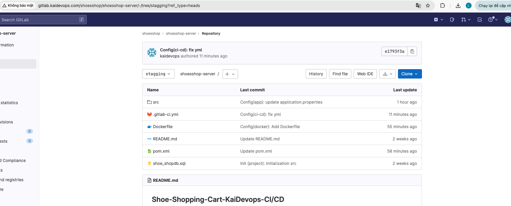
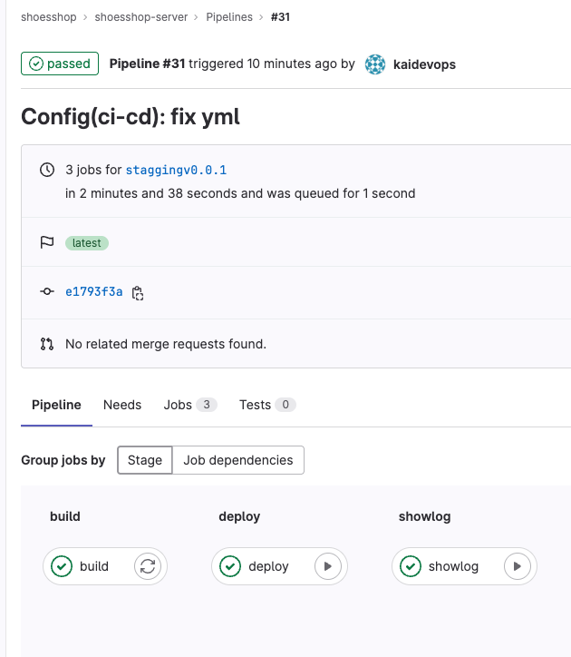
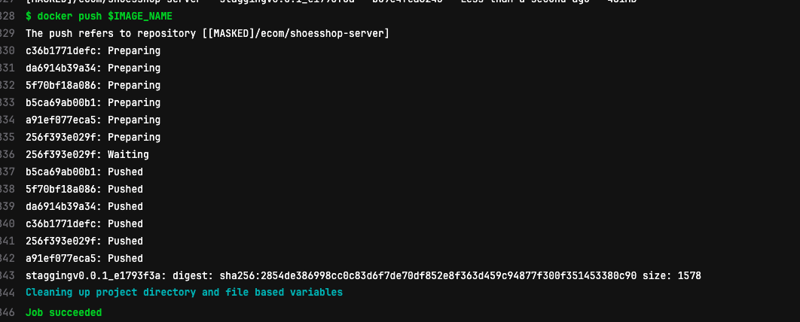
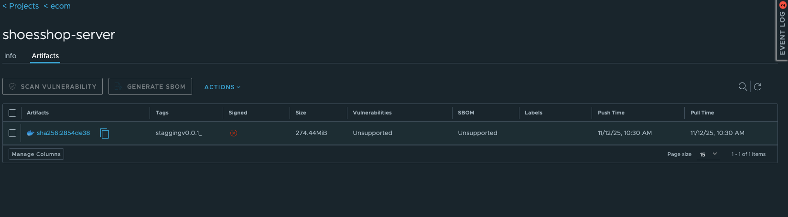
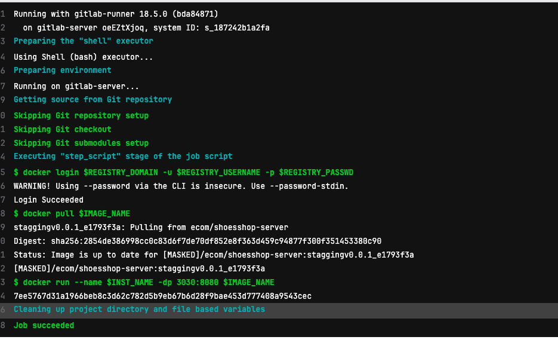
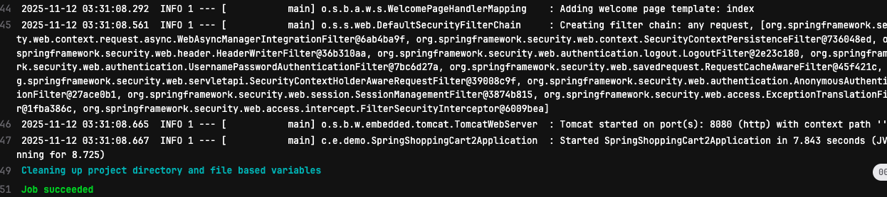

# GitLab CI/CD Integration with Harbor Registry

## Overview

This project demonstrates how to use **GitLab CI/CD** with **Harbor Registry** to automate Docker image build, push, and deploy processes.

- **GitLab CI/CD:** Automates the build–test–deploy workflow.  
- **Harbor Registry:** Stores and secures Docker images.  
- **Goal:** Build a secure and continuous DevSecOps pipeline.

---

## 🏗️ 1. Repository Structure

- `Dockerfile` and application source code  
- `.gitlab-ci.yml` – defines CI/CD pipeline  
- `images/` – contains all screenshots and illustrations  

**Repository interface on GitLab:**  

---

## 🔄 2. CI/CD Pipeline Overview

The pipeline includes main stages:

1. **Build:** Create Docker image from source  
2. **Push:** Upload image to Harbor  
3. **Deploy:** Run container from the latest image  
4. **Verify:** Test and check container logging  

**Pipeline overview:**  

---

## ⚙️ 3. Main Jobs in Pipeline

| Process  | Description                       |
|---------|-----------------------------------|
| Build   | Build Docker image from Dockerfile |
| Push    | Push image to Harbor Registry      |
| Deploy  | Run container from pushed image    |
| Test    | Check logs and verify container    |

**Job overview:**  

---

## 🗃️ 4. Harbor Image Management

Harbor acts as a **private container registry**, providing:
- Image version control  
- Security scanning  
- Role-based access (RBAC)

**Harbor image repository:**  

---

## 🚀 5. Running Instance

After the pipeline completes, GitLab Runner automatically deploys the latest image to a container environment.

**Job Running instance:**  

---

## 📜 6. Simple Logging

A basic logging setup is included to monitor CI/CD activity and container behavior.

**Example logging:**  

---

## 💡 7. Conclusion

Integrating **GitLab CI/CD** with **Harbor Registry** provides:
- Full automation of build → push → deploy  
- Secure image management  
- Modern DevSecOps workflow – simple, reliable, scalable  

---

## 📚 Copyright & Usage

© 2025 **QuocLap – KaiDevOps**  
All rights reserved.  
**Do not copy, modify, or redistribute** any part of this project without permission.  

> 🚫 Unauthorized use or duplication is strictly prohibited.

---

📌 *Author:* QuocLap – KaiDevOps  
📅 *Updated:* 2025  
🔗 *Tools:* GitLab, Docker, Harbor, Linux
